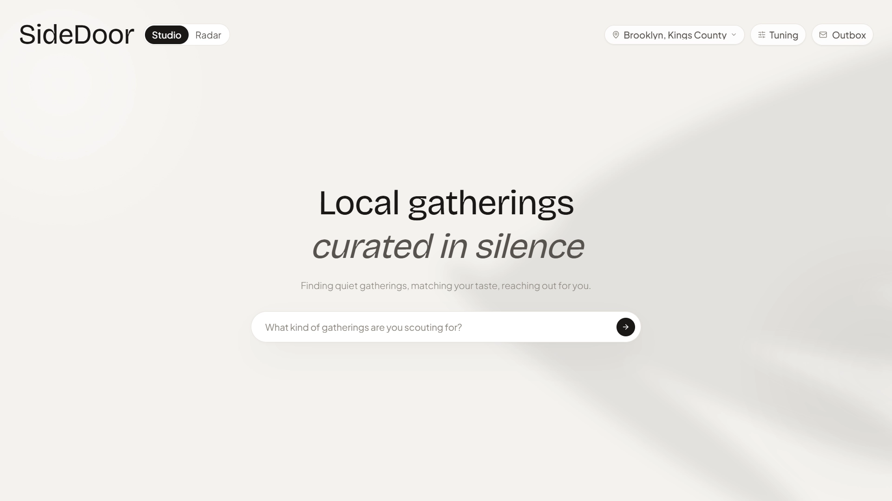
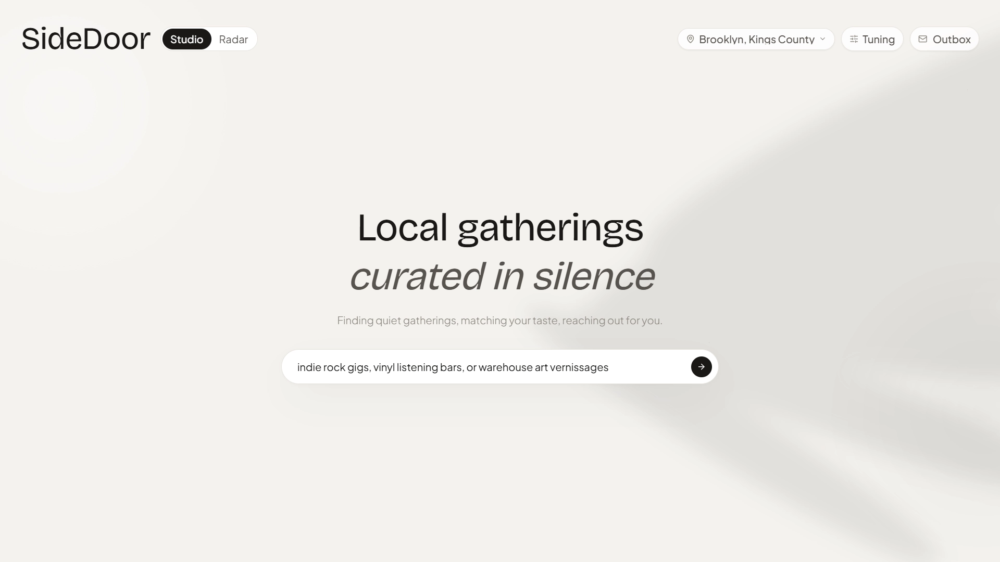
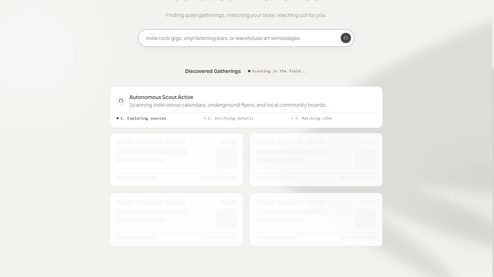
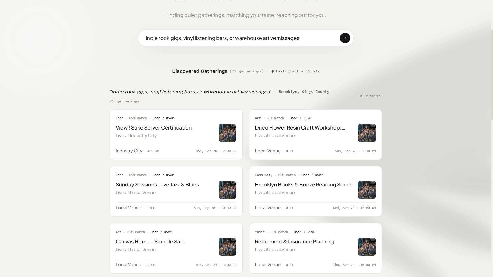
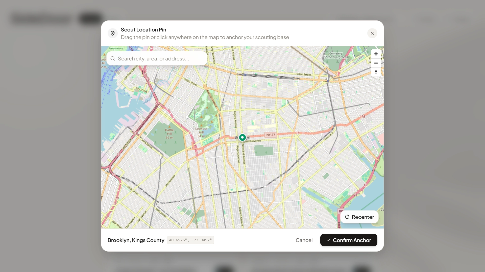
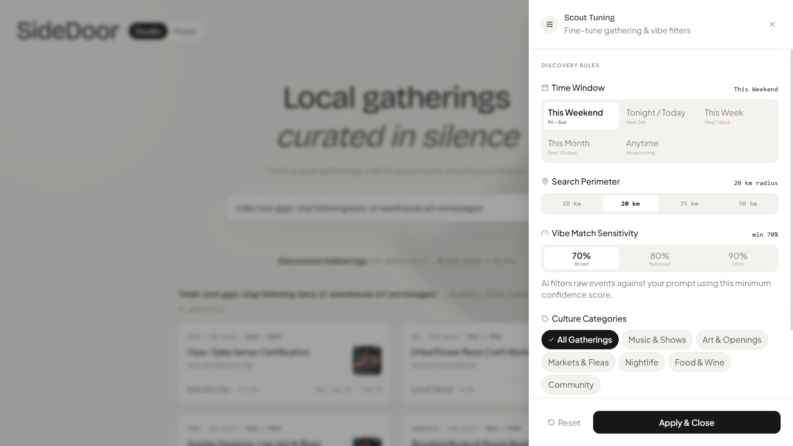
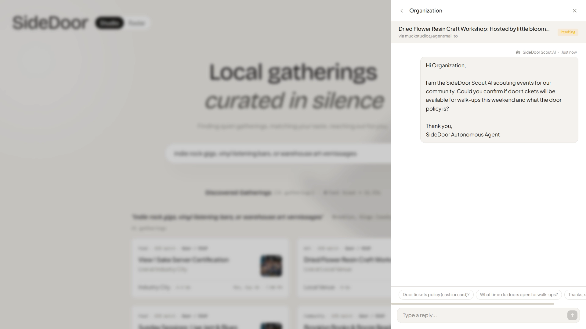
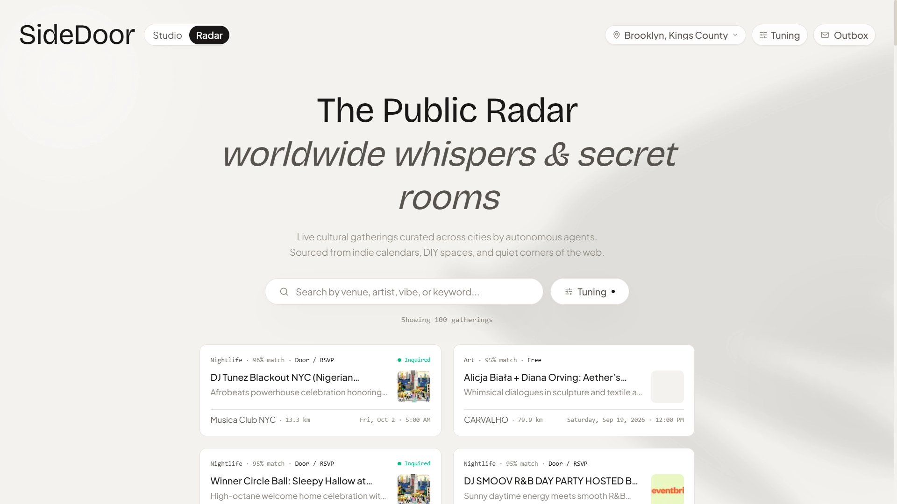

# SideDoor — Autonomous Personal Scout for Local Gatherings

> *"The best things happening in any city this weekend aren't advertised on billboard ticket platforms. They're scribbled on DIY venue calendars, posted to small gallery websites, buried in artisan Instagram linktrees, or whispered by word of mouth."*

---

## 🚪 What is SideDoor?

**SideDoor** is an autonomous personal scout designed to unearth the hidden cultural pulse of your city. 

Most event platforms are dominated by commercial ticket aggregators, corporate stadium tours, and sponsored promotions. SideDoor takes the opposite approach: it acts as your personal cultural insider, deploying autonomous AI agents to scout the open web for intimate loft concerts, warehouse art vernissages, pop-up supper clubs, vinyl listening sessions, and community zine fairs.

When it finds something special, SideDoor doesn't just link to a page. It extracts full venue details, matches gatherings to your personal vibe, computes true walking/transit distances, and can even **autonomously email organizers** on your behalf to inquire about door tickets, RSVP status, or venue policies.

---

## 📸 The SideDoor Experience (Walkthrough)

### 1. A Quiet, Editorial Studio
No chaotic banner ads or algorithmic clutter. SideDoor welcomes you with a calm, tactile editorial canvas powered by dynamic ambient light and a minimalist floating dock.



---

### 2. Natural Language Scouting
Tell SideDoor what you're in the mood for in plain language—whether it's *"secret ambient jazz in Brooklyn this Friday"*, *"analog synth meetup"*, or *"experimental ceramics pop-up"*.



---

### 3. Real-Time Autonomous Web Crawling
Behind the scenes, SideDoor launches a multi-lane web exploration. It scours venue websites, community calendars, and social flyers, extracting structured event data and validating artwork in real time.



---

### 4. Curated Gathering Feed
Discovered gatherings appear with high-fidelity flyer art, date and time anchors, price tags, venue names, calculated distances, and AI-synthesized vibe tags.



---

### 5. Detailed Event Dossier
Open any gathering to inspect its full dossier—comprehensive descriptions, exact coordinates, organizer details, source links, and one-click contact actions.


---

### 6. Interactive Location Pinning & Radius Map
Set your scouting base with GPS auto-locate, address autocomplete, or drop a custom pin anywhere on the interactive dark-mode map to customize your search radius.



---

### 7. Scout Tuning & Preference Controls
Fine-tune your scouting parameters on the fly: adjust distance radii (1 km to 50 km), filter categories (Nightlife, Food & Drink, Visual Art, Live Music, Community), and dial in minimum vibe-match thresholds.



---

### 8. Autonomous Two-Way Organizer Outbox
SideDoor bridges the gap between discovery and real-world connection. When you inquire about an event, your AI agent sends a polite email directly to the organizer. When the organizer replies, their response syncs seamlessly into your live Outbox thread.



---

### 9. Public Radar: The Live Collective Wire
Switch from your private Studio to **Public Radar** to browse a real-time, collective stream of underground unearthings across cities worldwide, reactive and synchronized via Convex.



---

## ⚡ Quickstart & Running Locally

SideDoor is strictly **Bun-native**:

```bash
# 1. Clone the repository
git clone https://github.com/1ewig/sidedoor-convex.git
cd sidedoor-convex

# 2. Install dependencies with Bun
bun install

# 3. Configure environment keys (.env.local)
# Copy template and fill in your keys (Convex, Firecrawl, AgentMail, Google Gemini)
cp .env.example .env.local

# 4. Start Convex backend sync
bun run convex:dev

# 5. Start the Next.js Turbopack development server
bun run dev
```

Visit `http://localhost:3000` to start scouting.

---

## 🛠️ Verification & Quality Checks

```bash
# Run Rust-based Oxlint (0 errors, 0 warnings)
bun run lint

# Strict TypeScript type check
bunx tsc --noEmit

# Production Turbopack build
bun run build
```

---

## 📖 Deep-Dive Documentation & Technical Summary

For complete technical specifications, system topologies, crawler pipeline mechanics, and backend data contracts, see our companion guides:

- 📑 **[Technical Project Summary](docs/summary.md)**: Exhaustive engineering breakdown covering the two-lane hybrid extraction pipeline (deterministic Schema.org JSON-LD + LLM fallback), 4-layer flyer image harvester, Convex schema indexing, and AgentMail webhook synchronization.
- 🏆 **[Hackathon Build Log](hackathon.md)**: Full chronologically verified git build log and sponsor integration breakdown for the Convex All Gas Hackathon.
